# MRBOT

The **m**ultiple **r**gb ro**bot** (**mrbot**) is a robotic system meant to be use in simple tests and to serve as example for ATOM beginners.

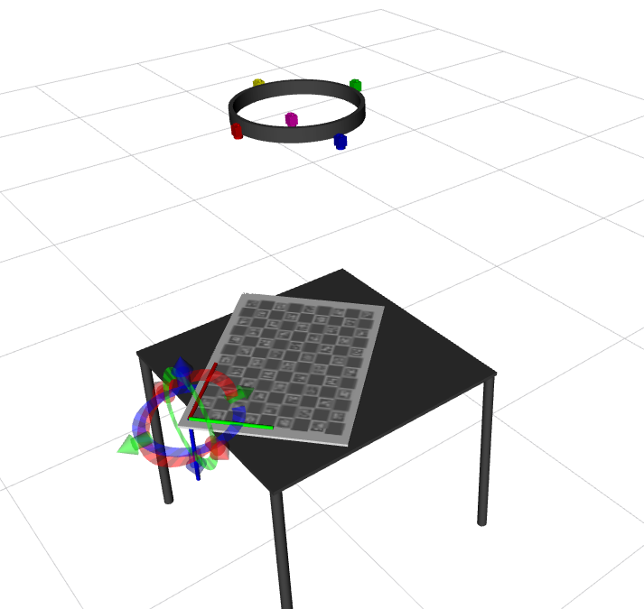

The system is composed of two rgb cameras mounted on a tripod.
Cameras are called **rgb_left** (red) and **rgb_right** (green).
The system contains the following topics:

  - /rgb_left/camera_info
  - /rgb_left/image_raw
  - /rgb_right/camera_info
  - /rgb_right/image_raw
  - /tf
  - /tf_static

Since this is a systems to test calibration, where frame rate is not a critical issue, we restrained images topics to 10Hz.
This is a simulated system, which can be seen in gazebo:

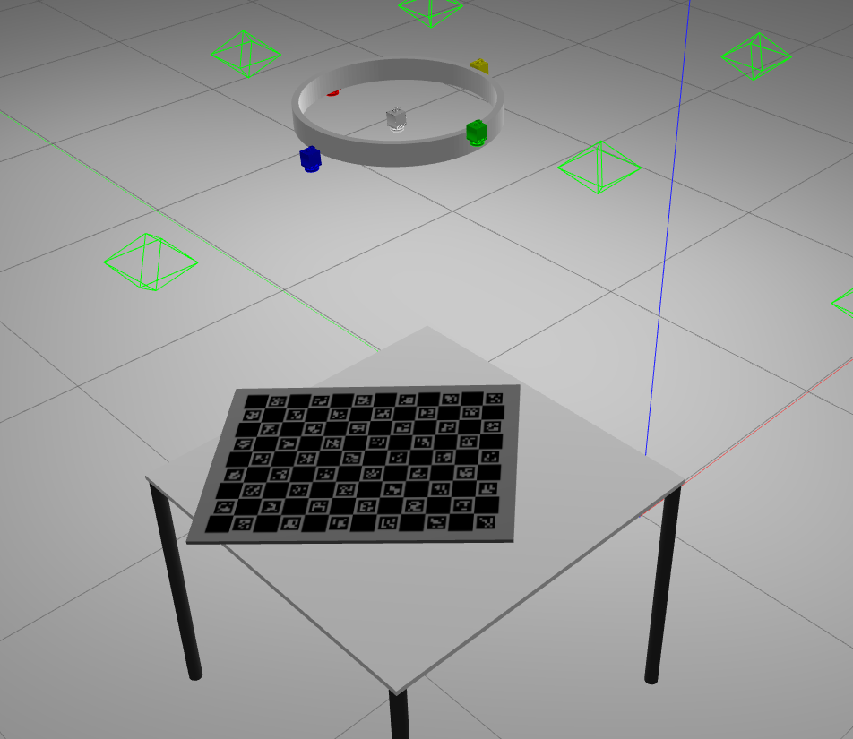

... and in rviz:

# How to run

First launch the gazebo simulation:

    roslaunch mrbot_gazebo gazebo.launch

Then you can bringup the system:

    roslaunch mrbot_bringup bringup.launch

You can record a bag file using:

    roslaunch mrbot_bringup record.launch

This will put the bag file into your $ROS_BAGS folder.

# Calibration

The calibration of any robotic system using **ATOM** may have several variants. We recommend a careful reading of the [documentation](https://lardemua.github.io/atom_documentation/) to learn all the details.

In this section, out goal is to carry out the simplest possible calibration pipeline for the **mrbot**.

To calibrate, we will use the [$ROS_BAGS/mrbot/train.bag](https://drive.google.com/file/d/1Noo3eZh72m-xRobYZywdo1wtqg7e4wGa/view?usp=sharing) bagfile, which contains a recording of the system's data when viewing a calibration pattern in several positions. We produced the bagfile by bringing up the system and then recording a bagfile as described above. This is a small bagfile with 40 seconds / 60MB for demonstration purposes. Typically, calibration bagfiles are larger.

Next we describe each of the steps in the calibration pipeline.

## Creating a calibration package

See also the [generic documentation](https://lardemua.github.io/atom_documentation/procedures/#create-a-calibration-package) on this topic.

Using ATOM conventions, we define name of the calibration package as **mrbot_calibration**, and create it using:

    rosrun atom_calibration create_calibration_pkg --name mrbot_calibration

**NOTE**: This procedure is carried out only once, and was done already. As such, this ros package is already [included in the atom repo](https://github.com/lardemua/atom/tree/noetic-devel/atom_examples/mrbot/mrbot_calibration). Therefore, you **should not execute this instruction** for the mrbot.

## Configuring the calibration

This is the [config.yml](https://github.com/lardemua/atom/blob/noetic-devel/atom_examples/mrbot/mrbot_calibration/calibration/config.yml) that we wrote to define the calibration. There are two sensors to be calibrated, named **rgb_left** and **rgb_right**. The pattern is a charuco marker.
The configuration file points to the bagfile mentioned above, and the _anchored_sensor_ is defined as the **rgb_left** sensor.

To configure run:

    rosrun mrbot_calibration configure

Which will run a series of checks and produce several files inside the **mrbot_calibration** package.

## Collecting a dataset

To collect a dataset we run:

    roslaunch mrbot_calibration collect_data.launch output_folder:=$ATOM_DATASETS/mrbot/dataset1 overwrite:=true

And save a few collections.

We will use as example the [train](https://drive.google.com/file/d/1FobBsyxtI29hDt5NlKfAg7kFdsZxrcbG/view?usp=drive_link) dataset, which contains 4 collections, as shown bellow.

Download and decompress the dataset to **$ATOM_DATASETS/mrbot/train**.

Collection |           camera 1             |           camera 2 | camera 3 | camera 4 | camera 5
|:----------:|:----------:|:----------:|:----------:|:----------:|:----------:
0 | 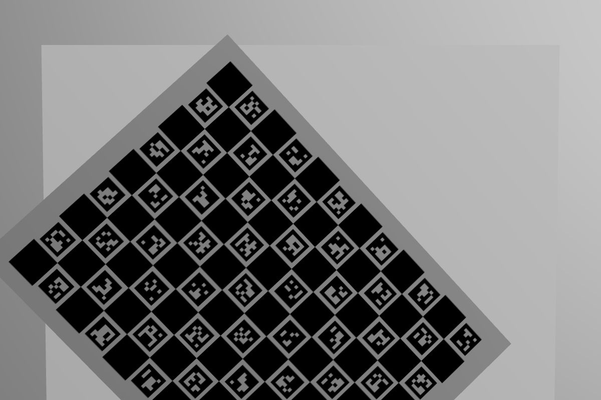 |  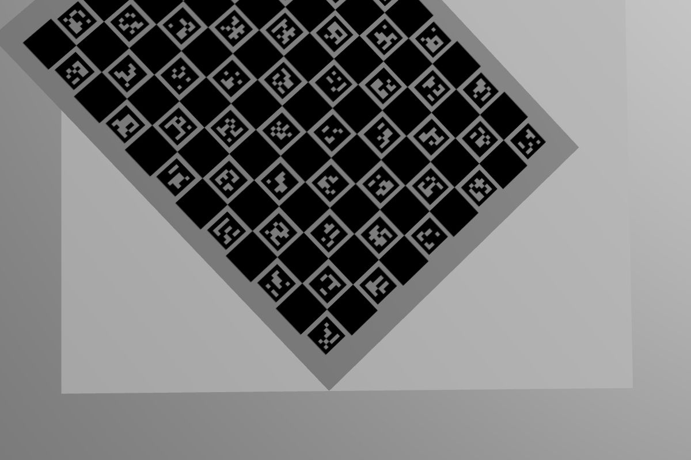 |  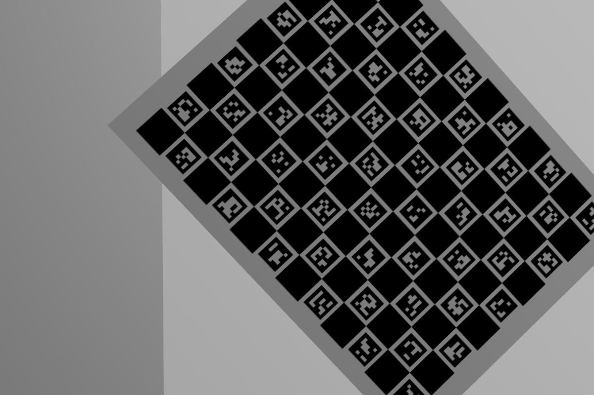 |   |  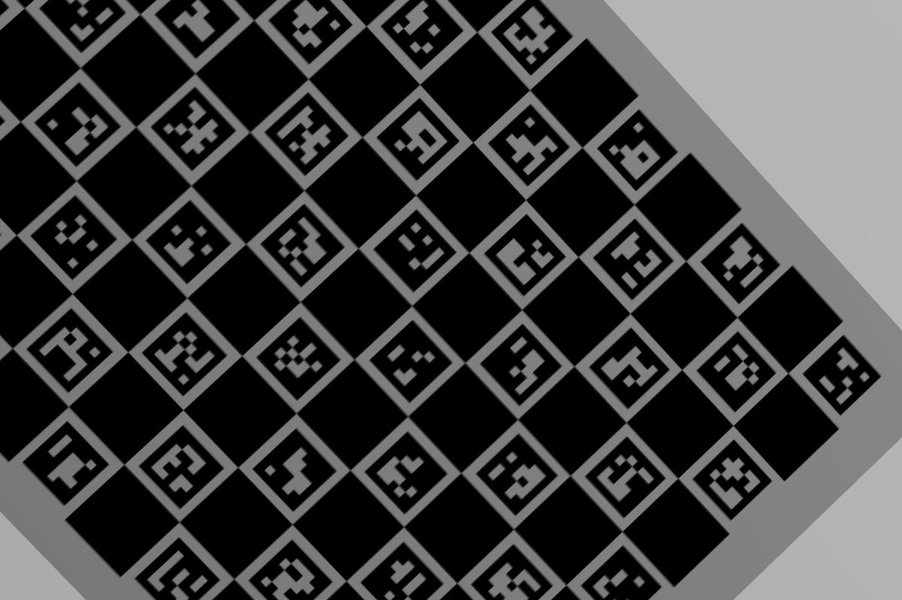
1 | 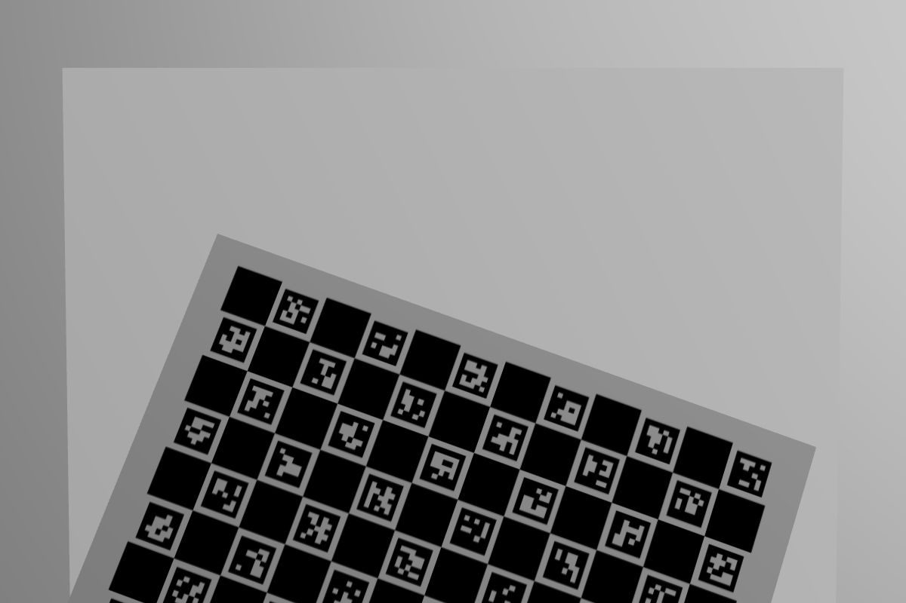 |  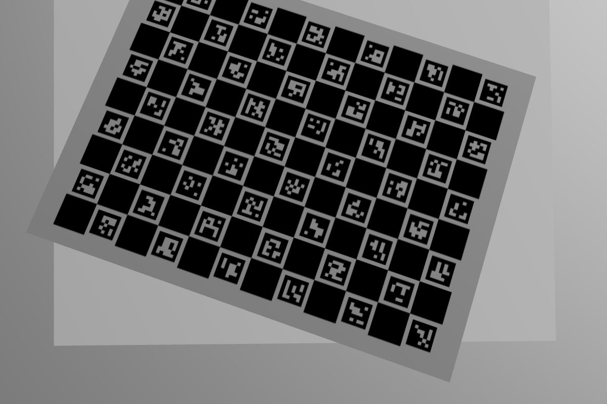 |  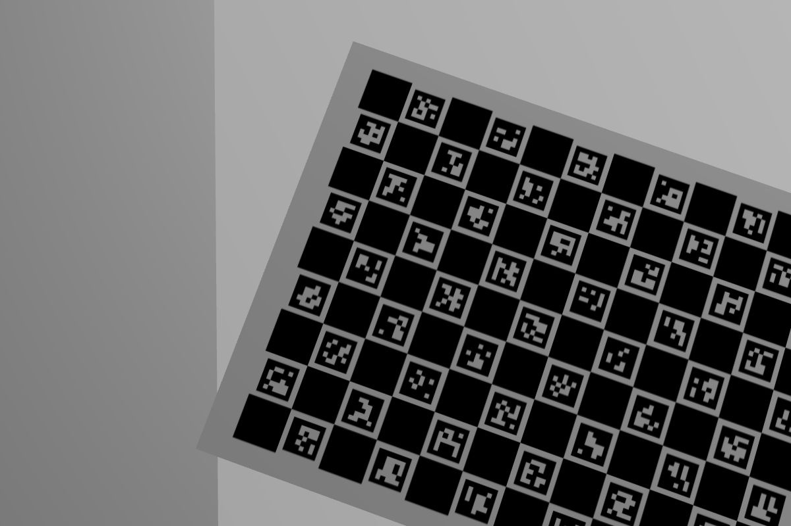 |  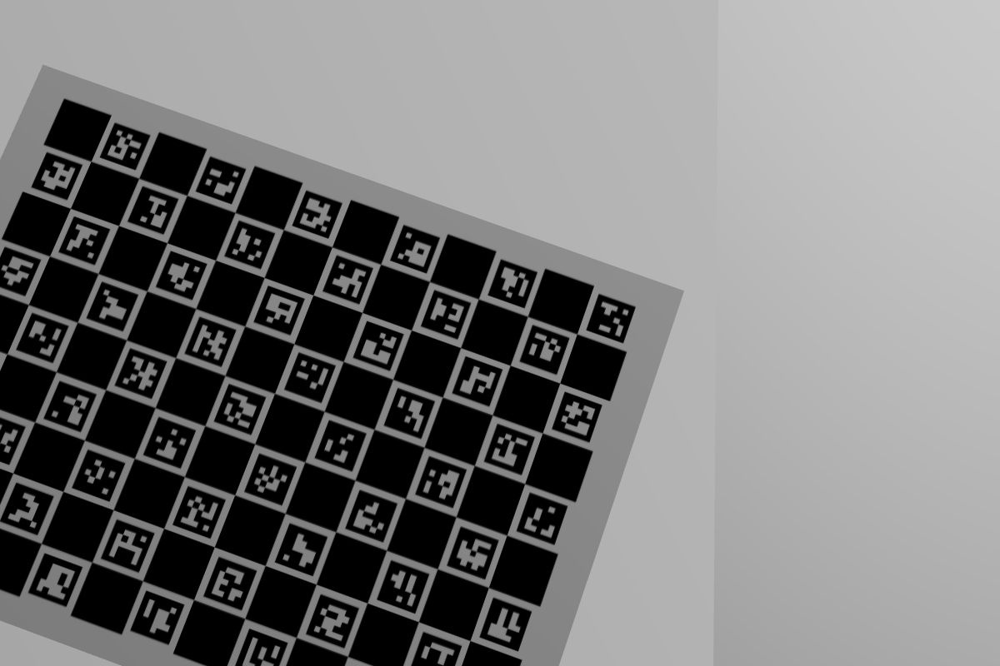 |  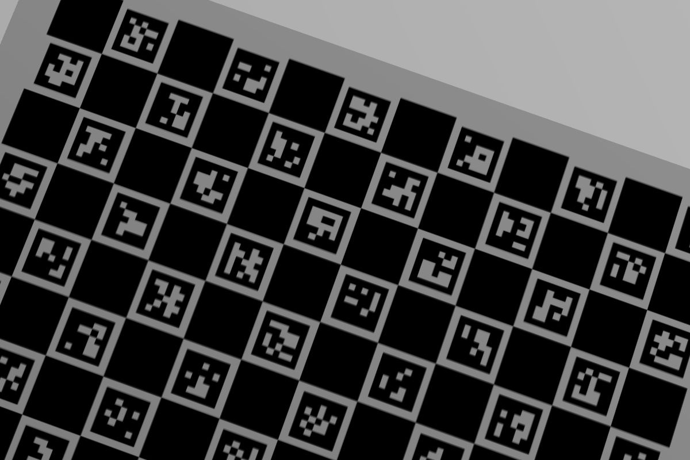
2 |  |  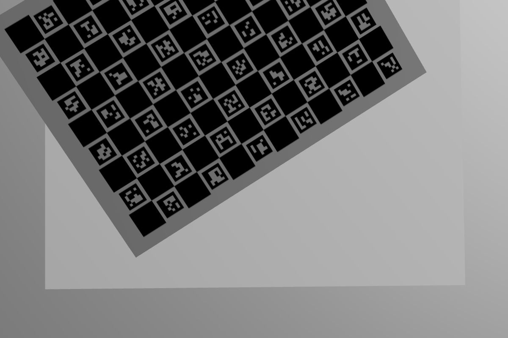 |   |  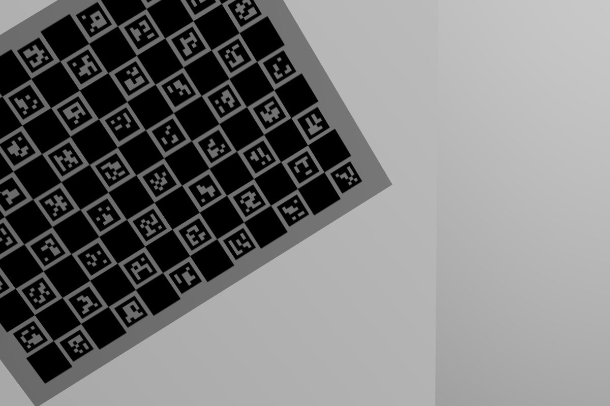 |  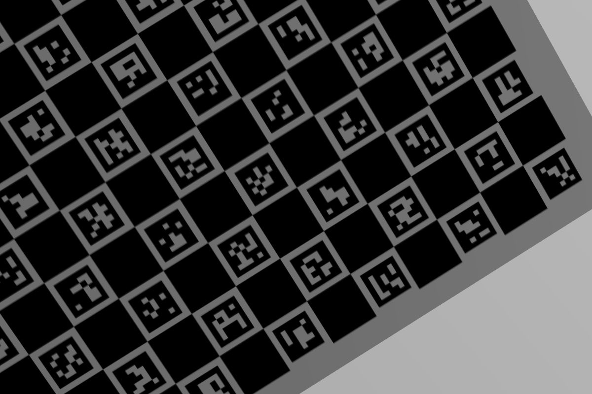

## Running the Calibration

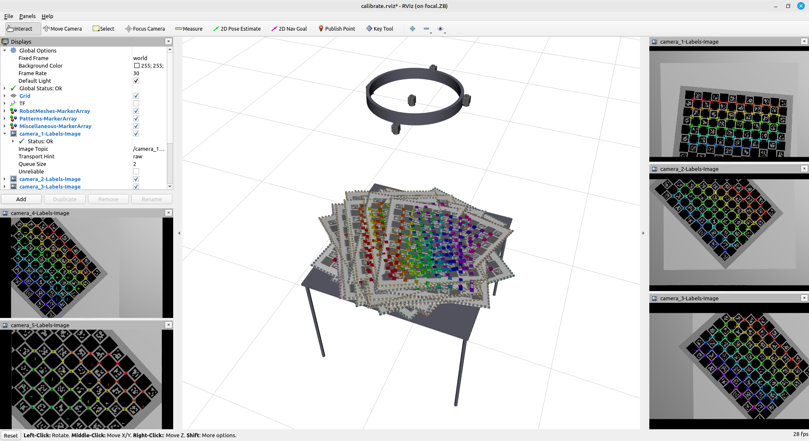

To calibrate, first setup visualization with:

    roslaunch mrbot_calibration calibrate.launch

Then carry out the actual calibration using:

    rosrun atom_calibration calibrate -json $ATOM_DATASETS/mrbot/train/dataset.json -v -rv -nig 0.03 0.03 -si -ipg -ctgt

This will produce a table of residuals per iteration, like this:

This is the table presented once calibration is complete, which shows average reprojection errors of under 1 pixel. Sub-pixel accuracy is considered a good result for rgb camera calibration.

