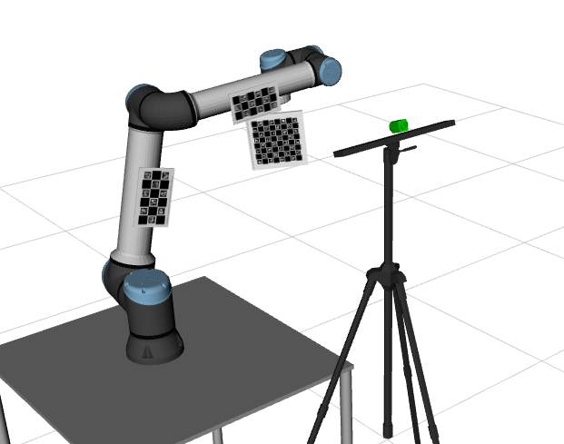
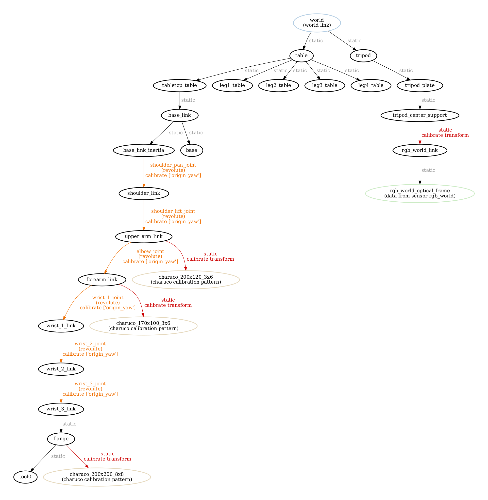
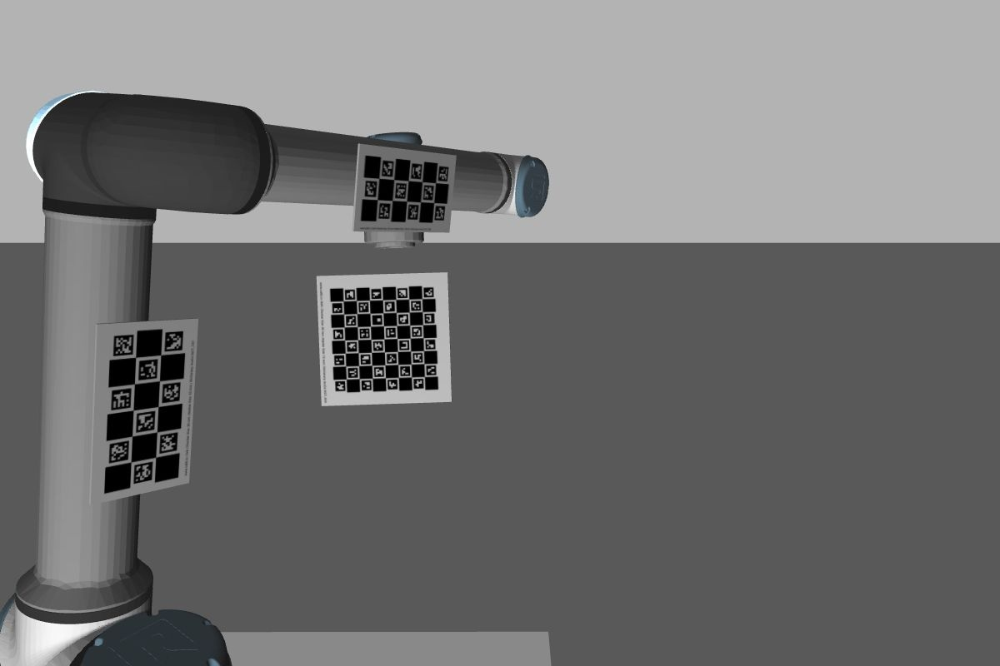
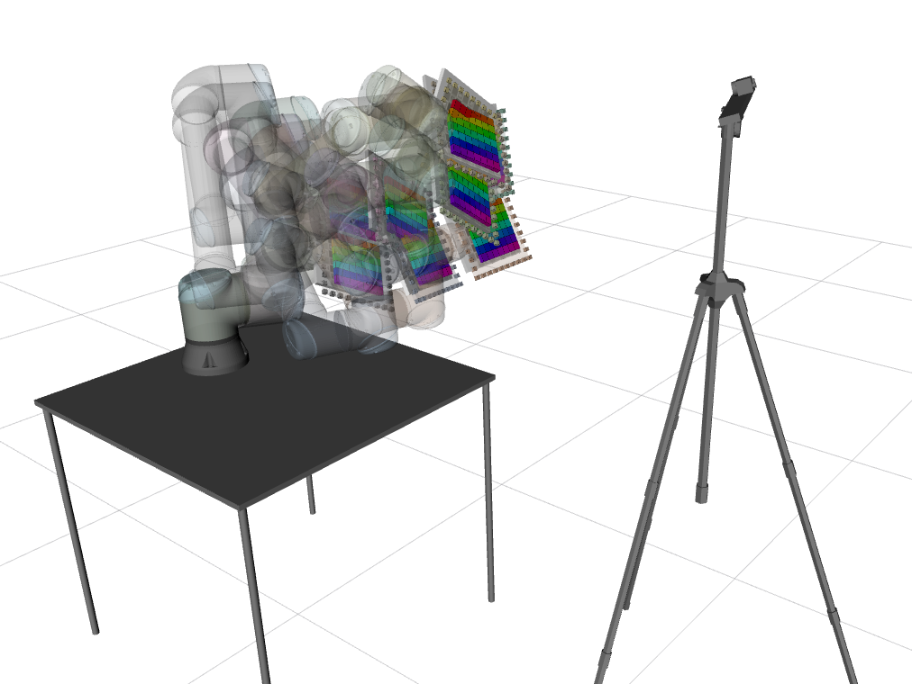
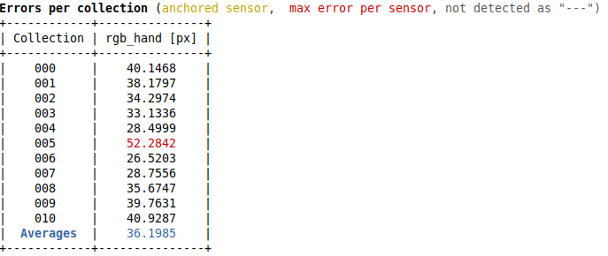
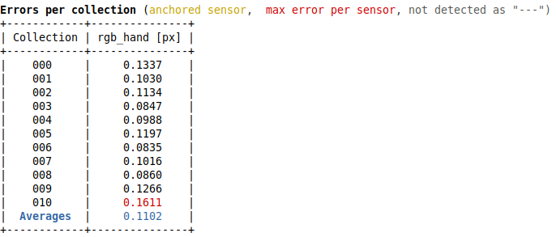

# RGB Eye in World Multiple Pattern system

The **R**GB **i**n **w**orld **m**ultiple **p**atterns ro**bot** (**riwmpbot**) is a robotic system used to evaluate how the usage of multiple patterns in ATOM can improve joint calibration.

The system contains a single rgb camera mounted on a tripod, facing a robotic manipulator.

The camera sensor is called **rgb_world** (green).
The system contains the following topics:

  - /rgb_world/camera_info
  - /rgb_world/image_raw
  - /tf
  - /tf_static
  - /joint_states

Since this is a systems to test calibration, where frame rate is not a critical issue, we restrained images topics to 10Hz.

The scene contains 3 calibration patterns positioned in several links of the robotic manipulator:

  - positioned on the upper_arm, a charuco, size 200x120 millimeters, corners layout 3x6, aruco dictionary 7x7
  - positioned on the forearm, a charuco, size 170x100 millimeters, corners layout 3x6, aruco dictionary 6x6
  - positioned on the flange, a charuco, size 200x200 millimeters, corners layout 8x8, aruco dictionary 4x4

This is a simulated system, which can be seen in gazebo:

... and in rviz:

# How to run

First launch the gazebo simulation:

    roslaunch riwmpbot_gazebo gazebo.launch

Then you can bringup the system:

    roslaunch riwmpbot_bringup bringup.launch

You can record a bag file using:

    roslaunch riwmpbot_bringup record.launch

This will put the bag file into your $ROS_BAGS folder.

# Calibration

As always, we recommend a careful reading of the [documentation](https://lardemua.github.io/atom_documentation/) to learn all the details.

In this section, out goal is to describe the calibration pipeline for the **riwmpbot**.

To calibrate, we will need a bagfile called [train.bag](https://drive.google.com/file/d/1_YYIaJfvP8G7_mBr3oT7S7RkVTymu2pb/view?usp=sharing), which contains a recording of the system's data when viewing a calibration pattern in several positions.
We produced the bagfile by bringing up the system and then recording a bagfile as described above.
This is a bagfile with 140 seconds / 115MB for demonstration purposes. Typically, calibration bagfiles are larger.

Download the bagfile and put it in **$ROS_BAGS/riwmpbot**.

Next we describe each of the steps in the calibration pipeline.

## Creating a calibration package

See also the [generic documentation](https://lardemua.github.io/atom_documentation/procedures/#create-a-calibration-package) on this topic.

Using ATOM conventions, we define name of the calibration package as **riwmpbot_calibration**, and create it using:

    rosrun atom_calibration create_calibration_pkg --name riwmpbot_calibration

**NOTE**: This procedure is carried out only once, and was done already. As such, this ros package is already [included in the atom repo](https://github.com/lardemua/atom/tree/noetic-devel/atom_examples/riwmpbot/riwmpbot_calibration). Therefore, you **should not execute this instruction** for the riwmpbot.

## Configuring the calibration

This is the [config.yml](https://github.com/lardemua/atom/blob/noetic-devel/atom_examples/riwmpbot/riwmpbot_calibration/calibration/config.yml) that we wrote to define the calibration. There is a single sensor to be calibrated, named **rgb_hand**. The pattern is a charuco marker.
The configuration file points to the train bagfile mentioned above, and the _anchored_sensor_ is not defined.

To configure run:

    rosrun riwmpbot_calibration configure

Which will run a series of checks and produce several files inside the **riwmpbot_calibration** package.

The configuration produces a [visual schematic summarizing](https://github.com/lardemua/atom/blob/noetic-devel/atom_examples/riwmpbot/riwmpbot_calibration/calibration/summary.pdf) the calibration you have setup.

It is advisable to inspect this document carefully to make sure that the calibration is well configured.

## Collecting a dataset

To collect a dataset we run:

    roslaunch riwmpbot_calibration collect_data.launch output_folder:=$ATOM_DATASETS/riwmpbot/dataset1 overwrite:=true

And save a few collections.

We will use as example the [train](https://drive.google.com/file/d/1YlFdik-38zhtI8fByY27XR7pxYdN-h_9/view?usp=sharing) dataset, which contains 44 collections. Some are shown below.

Download and decompress the dataset to **$ATOM_DATASETS/riwmpbot/train**.

Collection |           rgb_hand
:----------------:|:-------------------------:
0 | 
1 | 
7 | 
44 | 

## Running the Calibration

To calibrate, first setup visualization with:

    roslaunch riwmpbot_calibration calibrate.launch

This is useful to visualize the collections stored in the dataset.

Then carry out the actual calibration, we should include noise both in the sensor transformations as well as in the joint parameters to be estimated We do this with the arguments:

- **--noisy_initial_guess** (-nig), which randomizes noise on the translations and rotation components of the transformations to be estimated
- **--joint_bias_names** (-jbn), which defines which joints will be affected by a bias value
- **--joint_bias_params** (-jbp), which defines for each joint in **-jbn** which joint parameter is affected
- **--joint_bias_values** (-jbv), which defines for each joint / parameter combination the magnitude of the bias

Lets make up some noise values. We get the actual command like this:

    rosrun atom_calibration calibrate  -json ~/datasets/riwmpbot/train/dataset.json \
    -v -nig 0.05 0.02 -ctgt \
    -jbn shoulder_pan_joint shoulder_lift_joint elbow_joint wrist_1_joint wrist_2_joint wrist_3_joint \
    -jbp origin_yaw origin_yaw origin_yaw origin_yaw origin_yaw origin_yaw \
    -jbv 0.03 -0.02 0.03 -0.1 0.04 -0.09

This will produce a table of residuals per iteration, like this:

Which starts the calibration with these errors:

which are quite high, because of the incorrect pose of the sensors,  and ends up converging into these figures:

 This means the procedure has converged.

To be sure that the calibration was actually accurate, we can compare the estimated parameter values against the ground truth values contained in the original dataset, using the  **--comparison_to_ground_truth (-ctgt)** argument.
This will display tables comparing the initial errors (before starting to calibrate, after adding noise) against the errors obtained after calibration. These are the produced tables:

These tables clearly show an improvement in the errors after calibration. Moreover, after calibration, the magnitude of the errors is quite small. For example, on average, the translation error for the estimated transforms is 0.00085 which corresponds to 0.8 millimeters. For joint parameters the average error is 0.00666 radians (these are all revolute joints), which correspond to 0.38 degrees.